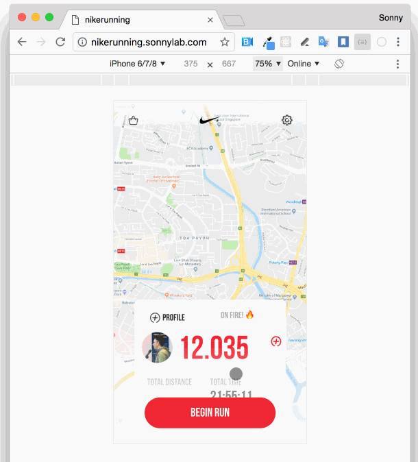

# Nike+ Running - React Native & React Native DOM (Web)

UI & UX Prototype of redesigned Nike+ Running App and now support website 🎉 thanks to [React Native DOM](https://github.com/vincentriemer/react-native-dom)




Inspiration: https://dribbble.com/shots/2764470-Rethinking-Nike-Running

## Motivation

I recently watched the [talk](https://youtu.be/aOWIJ4Mgb2k) from [@vincentriemer](https://twitter.com/vincentriemer) about [react native dom](https://github.com/vincentriemer/react-native-dom) and I amazed that we can port directly our current react native app into website. Then, I started this experiment and see the performance and the gesture in the web.

The result is fascinating. I can reuse almost all of the components except the map and linear gradient, so I make a quick hack for the LinearGradient Component.

## Demo

Website: http://nikerunning.sonnylab.com/

Expo Snack: https://snack.expo.io/@sonnylazuardi/nike-running-redesign

## Installation & Running

```
npm i
react-native run-ios
react-native run-android
```

for the web:

```
react-native start
```

open `http://localhost:8081/dom`

## Features

- FadedZoom Transition
  This will add forFadedZoom transition to react-navigation (you can use it on another project)

```
    transitionConfig: () => ({
      screenInterpolator: sceneProps => {
        return forFadedZoom(sceneProps);
      }
    })
```

- Swipeable Card
  The card can be swiped up-down to toggle hide and left-right to change current card view. Pan responder works smooth on the web 💪

- Geolocation & Animated Marker
  The homescreen will show your current location with animated marker. For map the web now still fallback to image, need to work on the map component for RND.

- Box Shadow & Gradient
  (iOS only) There will be shadow around the button and cards. I do some tricky part to achieve the linear gradient. I use gradient image and use similar LinearGradient props:

```
if (Platform.OS != "dom") {
  var LinearGradient = require("react-native-linear-gradient").default;
} else {
  var LinearGradient = require("../components/LinearGradient").default;
}
```

© 2018 Sonny Lazuardi
